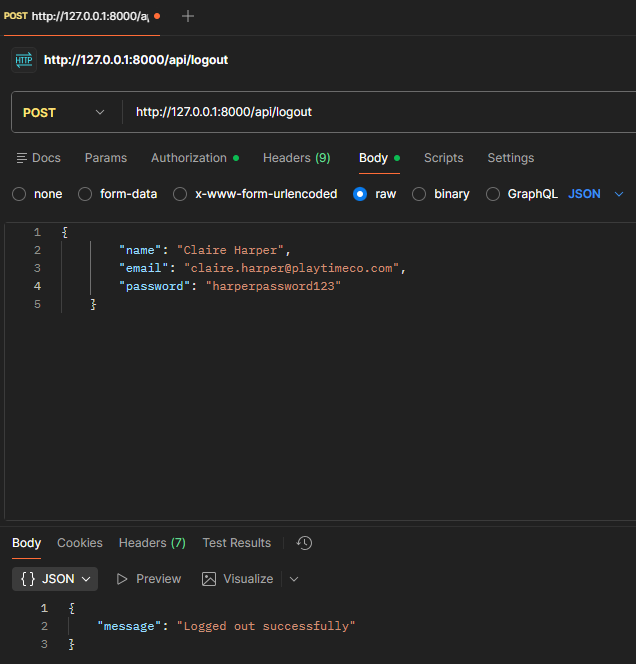
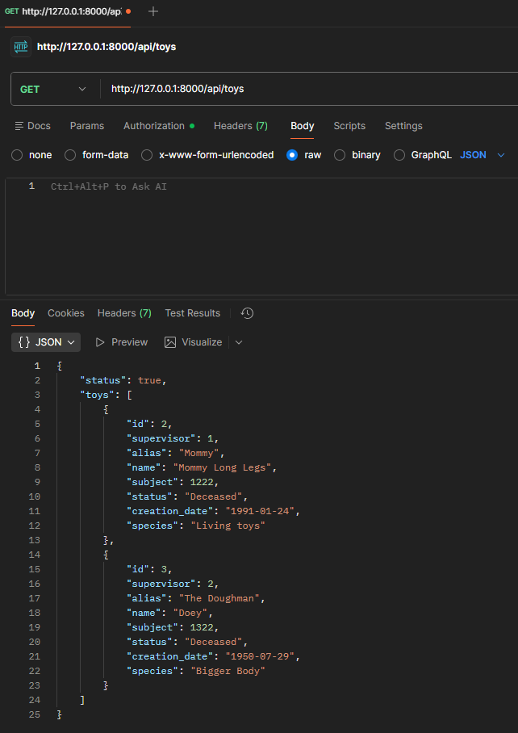
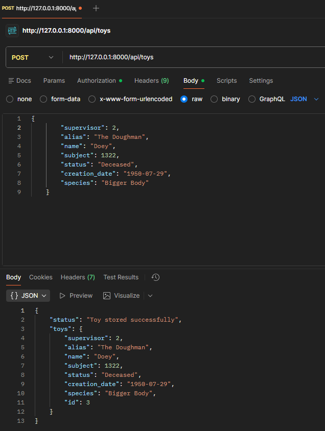
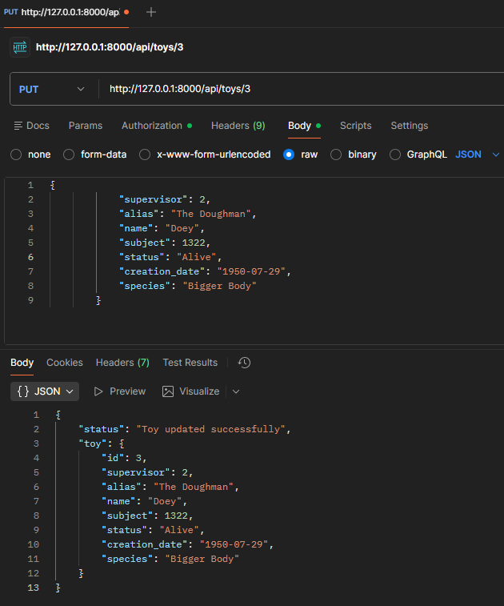

# PlaytimeCO API

<p align="center">
  
</p>

## 🎪 Acerca de PlaytimeCO API

**PlaytimeCO API** es una API REST desarrollada internamente para **Playtime Co**, la compañía de juguetes basada más aclamada del momento. Esta API gestiona la autenticación y administración de usuarios del ecosistema de la plataforma, así como la gestión completa del catálogo de juguetes.

Actualmente, la API se enfoca en proporcionar funcionalidades de **autenticación de usuarios** y **gestión de juguetes**, permitiendo registro, inicio de sesión, cierre de sesión, consulta de usuarios y operaciones CRUD completas sobre el catálogo de juguetes.

> **Nota:** esta compañía no es real, es meramente ficción :)
---

## 🛠️ Tecnologías Utilizadas

Esta API está construida con las siguientes tecnologías:

- **PHP** - Lenguaje de programación del servidor
- **Laravel** - Framework web poderoso
- **Composer** - Gestor de dependencias de PHP
- **MySQL/MariaDB** - Base de datos relacional
- **XAMPP** - Paquete que incluye Apache, MySQL y PHP
- **Postman** - Cliente HTTP para pruebas

---

## 📋 Requisitos Previos

Asegúrate de tener instalados los siguientes componentes:

- **XAMPP** (con Apache y MySQL habilitados)
- **PHP 8.0** o superior
- **Composer**
- **Postman** (para pruebas de endpoints)

## ⚙️ Instalación y Configuración

### 1. Clonar el Repositorio

```bash
git clone https://github.com/bintidev/PlaytimeCO-API_proy.git
```

### 2. Instalar Dependencias

```bash
composer install
```

### 3. Configurar el Archivo .env

Copia el archivo de ejemplo y configura tus variables de entorno:

```bash
cp .env.example .env
```

**Parámetros de Base de Datos a Configurar (usando XAMPP):**

```env
DB_CONNECTION=mysql
DB_HOST=127.0.0.1
DB_PORT=3306
DB_DATABASE=playtime_co
DB_USERNAME=root
DB_PASSWORD=
```

> ⚠️ **Nota:** XAMPP utiliza `root` como usuario por defecto sin contraseña.

### 4. Ejecutar Migraciones

```bash
php artisan migrate
```

### 5. Iniciar el Servidor de Desarrollo

```bash
php artisan serve
```

El servidor estará disponible en `http://127.0.0.1:8000`

---

## 📁 Estructura del Proyecto

```
PlaytimeCO-api/
├── app/
│   ├── Models/              # Modelos de datos
│   │   ├── User.php         # Modelo de usuario
│   │   └── Toy.php          # Modelo de juguete
│   └── Http/
│       └── Controllers/     # Controladores de la API
│           ├── AuthController.php  # Controlador de autenticación
│           └── ToyController.php   # Controlador de juguetes
├── routes/
│   ├── api.php              # Rutas de la API
├── database/
│   ├── migrations/          # Migraciones de base de datos
│   └── seeders/             # Datos de prueba
├── pictures/                # Capturas de pantalla de endpoints
├── user.json                # Ejemplos de usuarios para pruebas
└── README.md                # Este archivo
```

---

## 🔐 Endpoints Disponibles

La API proporciona los siguientes endpoints para la autenticación de usuarios y gestión de juguetes:

### Autenticación

#### 1. **Listar Todos los Usuarios**
- **Ruta:** `GET /api/users`
- **Descripción:** Obtiene la lista completa de todos los usuarios registrados en el sistema
- **Autenticación:** No requerida
- **Captura:** 

#### 2. **Registro de Usuario**
- **Ruta:** `POST /api/register`
- **Descripción:** Crea una nueva cuenta de usuario y devuelve un token de autenticación
- **Autenticación:** No requerida
- **Campos requeridos:**
  - `name` (string, máx. 255 caracteres)
  - `email` (email único)
  - `password` (string, mínimo 8 caracteres, debe estar confirmado)
- **Captura:** 

#### 3. **Inicio de Sesión**
- **Ruta:** `POST /api/login`
- **Descripción:** Autentica un usuario existente validando sus credenciales
- **Autenticación:** No requerida
- **Campos requeridos:**
  - `name` (string)
  - `email` (email)
  - `password` (string)
- **Captura:** 

#### 4. **Cerrar Sesión**
- **Ruta:** `POST /api/logout`
- **Descripción:** Invalida todos los tokens del usuario autenticado, cerrando su sesión
- **Autenticación:** Requerida (Bearer Token)
- **Captura:** 

---

### Gestión de Juguetes

#### 5. **Listar Todos los Juguetes**
- **Ruta:** `GET /api/toys`
- **Descripción:** Obtiene la lista completa de todos los juguetes disponibles en el catálogo
- **Autenticación:** No requerida
- **Captura:** 

#### 6. **Obtener un Juguete Específico**
- **Ruta:** `GET /api/toys/{id}`
- **Descripción:** Obtiene los detalles de un juguete específico por su ID
- **Autenticación:** No requerida
- **Parámetros:** `id` (integer) - ID del juguete
- **Captura:** 

#### 7. **Crear Nuevo Juguete**
- **Ruta:** `POST /api/toys`
- **Descripción:** Crea un nuevo juguete en el catálogo
- **Autenticación:** Requerida (Bearer Token)
- **Campos requeridos:**
  - `name` (string, máx. 255 caracteres)
  - `description` (text)
  - `price` (decimal)
  - `category` (string)
  - `stock` (integer)
- **Captura:** 

#### 8. **Actualizar Juguete**
- **Ruta:** `PUT /api/toys/{id}`
- **Descripción:** Actualiza la información de un juguete existente
- **Autenticación:** Requerida (Bearer Token)
- **Parámetros:** `id` (integer) - ID del juguete
- **Campos opcionales:** `name`, `description`, `price`, `category`, `stock`
- **Captura:** 

#### 9. **Eliminar Juguete**
- **Ruta:** `DELETE /api/toys/{id}`
- **Descripción:** Elimina un juguete del catálogo
- **Autenticación:** Requerida (Bearer Token)
- **Parámetros:** `id` (integer) - ID del juguete
- **Captura:** 

---

## 🧪 Pruebas con Postman

### Pasos para Comenzar:

1. **Abre Postman** en tu máquina
2. **Crea una nueva colección** para la API de PlaytimeCO
3. **Carga usuarios de ejemplo** desde el archivo `user.json`
4. **Asegúrate de que XAMPP esté ejecutándose** (Apache y MySQL activos)

### ⚠️ Importante: Gestión de Tokens

Cuando realices un registro exitoso, recibirás un **token de autenticación**. Este token debe ser almacenado en las **cabeceras (Headers)** de todas las peticiones subsecuentes que lo requieran:

```
Authorization: Bearer {tu_token_aqui}
```

**Ejemplo en Postman:**
1. Ve a la pestaña **Headers**
2. Añade una nueva fila con:
   - **Key:** `Authorization`
   - **Value:** `Bearer 1|eyJhbGciOiJIUzI1NiIsInR5cCI6IkpXVCJ9...`

> 💡 **Consejo:** Guarda el token en una variable de Postman para usarlo automáticamente en múltiples requests.

---

## 📊 Archivo de Ejemplo: user.json

Utiliza el archivo `users.json` para importar usuarios de prueba en Postman:

```json
{
    "name": "Claire Harper",
    "email": "claire.harper@playtimeco.com",
    "password": "harperpassword123",
    "password_confirmation": "harperpassword123"
}
```

## 👤 Archivo de Ejemplo: user.json

Utiliza el archivo `users.json` para importar usuarios de prueba en Postman:

```json
{
    "name": "Claire Harper",
    "email": "claire.harper@playtimeco.com",
    "password": "harperpassword123",
    "password_confirmation": "harperpassword123"
}
```

## 🧸 Archivo de Ejemplo: toys.json

Utiliza el archivo `toys.json` para importar juguetes de prueba en Postman:

```json
{
    "supervisor": 2,
    "alias": "Huggy",
    "name": "Huggy Wuggy",
    "subject": 1770,
    "status": "Alive",
    "creation_date": "1990-10-02",
    "species": "Bigger Body"
}
```

---

**¡Bienvenido al universo de Poppy Playtime! 🪆**